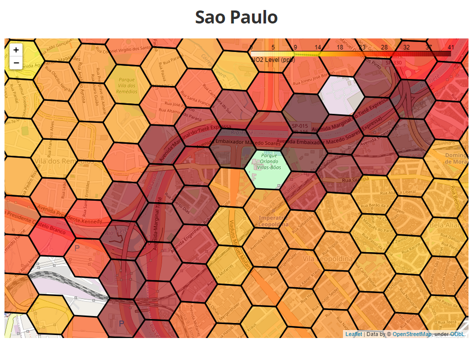

# Smart Cities - Predicting Pollution from Waze Data

Este projeto contempla o uso de dados de poluição atmosférica coletados na cidade de Oakland, CA, combinados com informações de trânsito do Waze e dados de vias do OpenStreeMaps, para gerar predições de índices de poluição atmosférica em diferentes regiões da cidade. O modelo foi então ajustado para outras cidades, como São Paulo, Quito, Lima e Montevideo, utilizando dados de estações de medição de poluição destas cidades.

Este repositório contém o código-fonte usado para treinar os modelos, para a inclusão de dados de estações de cada cidade contemplada, para execução das predições e geração de mapas de visualização.

Mais informações disponíveis no relatório de produto em:

*Colocar aqui o endereço do relatório*

## Visualização dos Dados

A visualização dos dados avalidos está disponível no endereço:

https://smart-cities-pollution.netlify.app/

## Inclusão de novos dados

Para gerar predições para uma nova cidade e/ou mês, os passos a se tomar são os seguintes:

1. **Obter os dados reais de poluição da cidade naquele mês em específico.** Naturalmente, esse passo varia de caso para caso, pois cada cidade costuma ter N estações de monitoramento localizadas em pontos diferentes, e não existe maneira uniforme de obtê-los, pois cada agência governamental pode disponibilizá-los (ou não) da maneira que for conveniente. Depois, basta colocar os dados obtidos na pasta `01 Pollution Data/{nome_cidade}/y_data.csv`, no mesmo formato das outras cidades. O h3id deve, idealmente, ter a resolução 9. Esse csv será usado para ajustar linearmente o modelo ao final do processo.
2. **Obter os dados do waze para as estações.** Este passo consiste em executar o arquivo `02 Waze Data/Generate Datasets`, depois, claro, de configurar o ambiente para acessar o Athena, através da AWS. Na segunda célula, é possível configurar o tamanho do raio em volta das estações a se considerar, bem como qual o tamanho máximo que cada consulta SQL pode ter. Ao executar este arquivo, ele irá realizar consultas SQL e irá armazenar os resultados em csvs na máquina local. Cada consulta costuma levar cerca de 6-10min, então o processo todo pode levar algumas horas, a depender da quantidade de cidades e raio considerado.
3. **Executar a predição.** O código completo é executado em `03 predictions/03 Prediction.ipynb`. Ali, pode-se configurar o período que deve ser considerado (se um dia, uma semana, um mês, ou qualquer outro período), além da data máxima (útil, por exemplo, para descartar os dias ao final de um mês que não completam uma semana). O raio ao redor das estações deve ser ajustado para corresponder ao que foi configurado no passo anterior. Ao executar o notebook, serão mostrados os gráficos com os ajustes e será gerado o dataset com as predições finais.
4. **Gerar os mapas,** através do arquivo `04 GUI/Generate GUI Files`. Esse passo irá ler o csv gerado no passo 3 e gerar os HTMLs correspondentes. Ao fim do processo, basta fazer upload da pasta www para o servidor que desejar, ou abrir os HTMLs diretamente no navegador.
